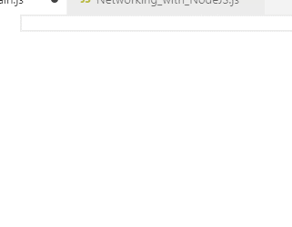

<div align="center">
<a href="https://github.com/des5141/Networking-with-Node.js/wiki">

</a>
</div>

# [Networking with Node.js](https://github.com/des5141/Networking-with-Node.js)

Can make online game with ease and quick

1. Go to a file in **GitHub**
2. Extract `Networking_with_NodeJs.gmez` in your **Project**
3. Learning `How to use` in **[Wiki](https://github.com/des5141/Networking-with-Node.js/wiki)**
4. Typing basic networking code in `Client`, `Server` and **Enjoy !**

> I upload new functions on my [blog](https://blog.naver.com/rhea31) about this repo  
> And I also [@Dev_Liberty](https://twitter.com/Dev_Liberty) on twitter for updates.

## Important

### Point

* Buffer fuctions is almost the same
> GM:S is using `js_read` `js_write`, Node.js is using `BM.read` `BM.write`
> 
```js
// Node.js
var read_buffer = BM.load(data);               // load buffer
var get_index1 = BM.read(read_buffer, BM.u8);  // buffer_read(read_buffer, buffer_u8);

var write_buffer = BM.create(1024);            // buffer_create(1024, buffer_grow, 1);
BM.write(write_buffer, BM.u8, get_index1);     // buffer_write(write_buffer, buffer_u8);
```

* Very easy to use

* Based Event

* ~~Support **Socket.io**~~ **: Not yet**

### Version

* 2019 01/21 - **Basic** , **Cluster** is Created

* 2019 04/04 - **Basic** is Remastered 
  
> fast, ease, light, quick developing then before !

## Support Git History

### Credits

Based on these amazing projects:

- Liberty🌠 by [Jeong Hyeon Kim](https://github.com/des5141)

## License

Apache License 2.0